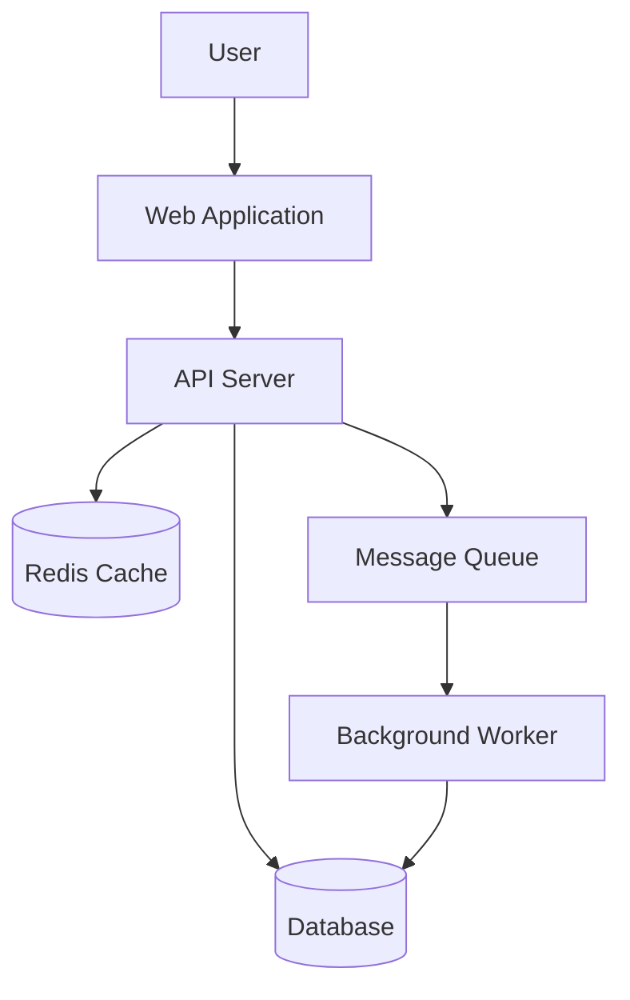
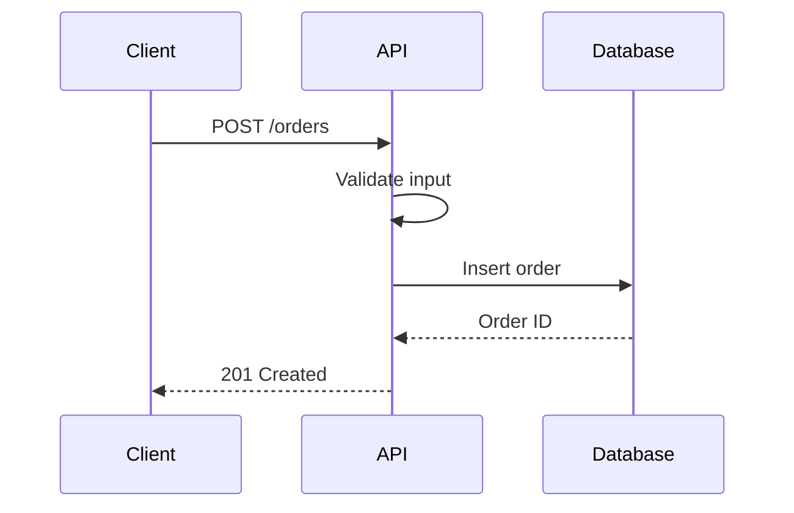
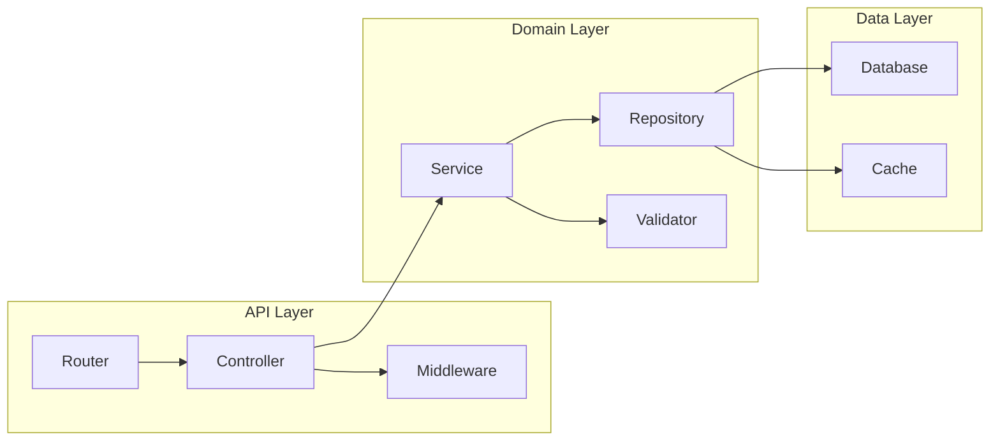

<!-- managed-by: copilot-agent-kit -->
---
name: 'architecture'
description: 'Use when making architectural decisions, documenting system design, or evaluating trade-offs'
---

# Architecture

## Architecture Decision Records (ADRs)

Record significant architectural decisions using this format. Store ADRs in `docs/adr/` with filenames like `001-use-postgres.md`.

```markdown
# ADR-NNN: Title

## Status
Proposed | Accepted | Deprecated | Superseded by ADR-NNN

## Context
What situation or problem prompted this decision. Include constraints, requirements,
and any forces that influence the choice.

## Options Considered

### Option A: [Name]
- **Pros**: ...
- **Cons**: ...
- **Estimated effort**: ...

### Option B: [Name]
- **Pros**: ...
- **Cons**: ...
- **Estimated effort**: ...

### Option C: [Name]
- **Pros**: ...
- **Cons**: ...
- **Estimated effort**: ...

## Decision
Which option was chosen.

## Rationale
Why this option was selected over the alternatives. What criteria were decisive.

## Consequences
What changes as a result. What trade-offs are accepted. What new constraints are introduced.
```

## Trade-Off Analysis

Before making any architectural choice:

1. **List at least two viable options** -- if there is only one option, you have not looked hard enough
2. **Identify pros and cons for each** -- be honest about downsides of the preferred option
3. **Evaluate across dimensions**:

| Dimension | Question |
|-----------|----------|
| Complexity | How much does this add to the system's overall complexity? |
| Performance | Does this meet performance requirements? Where are the bottlenecks? |
| Maintainability | Can future developers understand and modify this? |
| Team familiarity | Does the team have experience with this approach/technology? |
| Testability | Can this be tested effectively at unit and integration levels? |
| Scalability | Will this approach handle growth in data, users, or features? |
| Cost | What are the operational and development costs? |

4. **Document the decision** using the ADR format
5. **Revisit if assumptions change** -- decisions are not permanent

## Design Principles

| Principle | Application |
|-----------|-------------|
| Composition over inheritance | Build behavior by combining small, focused components rather than deep class hierarchies |
| Design for testability | If it is hard to test, the design needs work. Inject dependencies, avoid global state |
| Depend on abstractions | Use interfaces at system boundaries, not concrete implementations |
| Single responsibility | Each module, class, and function does one thing well |
| Fail fast | Validate early, surface errors close to their source, do not pass bad data downstream |

## Common Patterns

| Pattern | Use When |
|---------|----------|
| Repository | Abstracting data access behind a clean interface; enables swapping storage backends and testing without a database |
| Factory | Object creation logic is complex, varies by context, or needs to be centralized |
| Strategy | Algorithm or behavior needs to be swappable at runtime without modifying the caller |
| Observer | Components need to react to events without tight coupling between producer and consumer |
| Adapter | Integrating with external systems or legacy code; translates between incompatible interfaces |

## Anti-Patterns to Avoid

| Anti-Pattern | Problem | Solution |
|-------------|---------|----------|
| God objects | Classes/modules that do everything; impossible to test, modify, or understand | Break into focused components with single responsibilities |
| Premature abstraction | Generalizing before having concrete cases; creates wrong abstractions | Wait for at least two concrete cases before abstracting |
| Circular dependencies | Modules that depend on each other; fragile, hard to test in isolation | Restructure with dependency inversion or extract shared interface |
| Deep inheritance hierarchies | Rigid, brittle hierarchies where changes cascade unpredictably | Flatten with composition; prefer interfaces over base classes |
| Shared mutable state | State accessed and modified from multiple places; race conditions, unpredictable behavior | Isolate state behind clear ownership; use immutable data where possible |

## Mermaid Diagrams

Use Mermaid diagrams to document system design. Include them in ADRs and design documents.

### System Context Diagram



### Sequence Diagram



### Component Diagram



Choose the diagram type that best communicates the design decision or system structure being documented.
