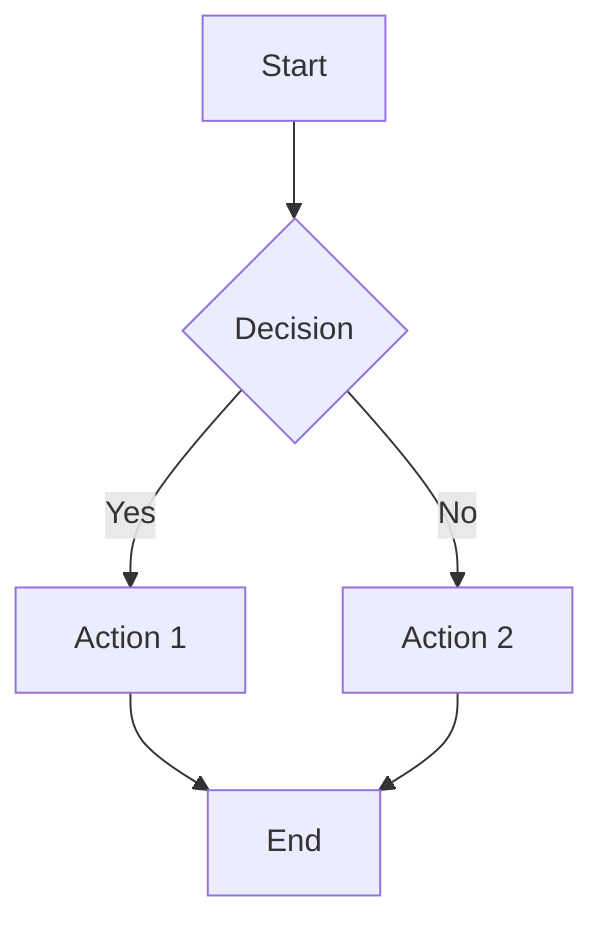
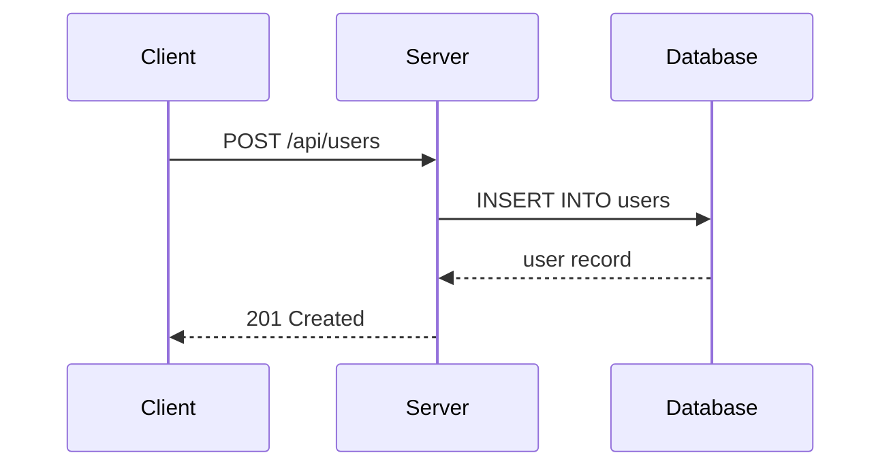
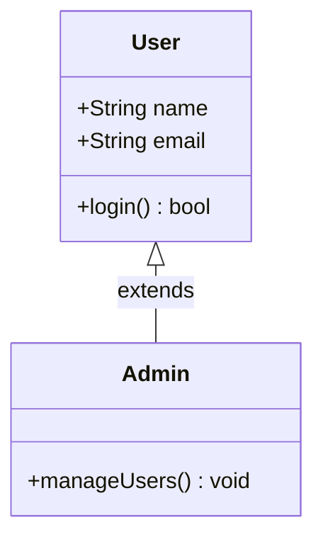
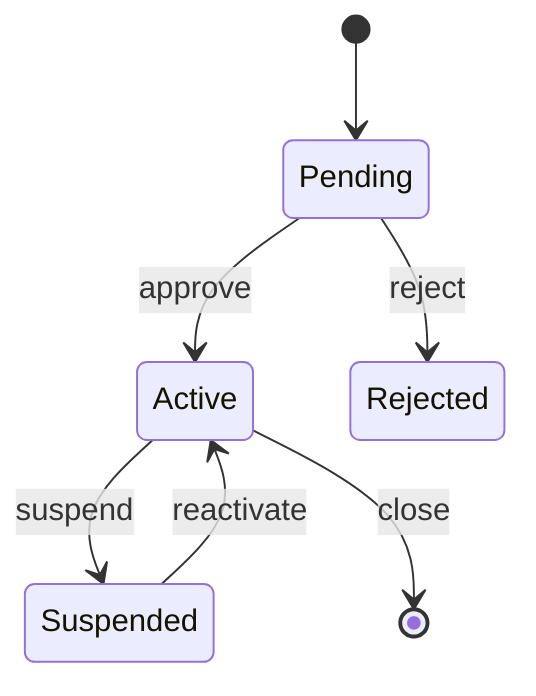

<!-- managed-by: copilot-agent-kit -->
---
name: 'documentation'
description: 'Use when writing READMEs, API docs, ADRs, changelogs, or any project documentation using Markdown and Mermaid diagrams'
---

# Documentation

GitHub-Flavored Markdown reference, Mermaid diagrams, and documentation templates.

## Writing Principles

- **Clear over clever** -- use simple language; avoid jargon unless the audience expects it
- **Concrete over abstract** -- show specific examples, not vague descriptions
- **Examples over explanations** -- a code snippet is worth a paragraph of prose
- **Scannable structure** -- use headings, lists, and tables so readers can find what they need
- **Keep it current** -- outdated documentation is worse than no documentation
- **Audience-first** -- write for the person reading, not the person writing

## GitHub-Flavored Markdown (GFM) Reference

### Headings

```markdown
# H1 -- Page title (use once per document)
## H2 -- Major sections
### H3 -- Subsections
#### H4 -- Details (avoid going deeper than H4)
```

### Text Formatting

```markdown
**bold** for emphasis
*italic* for terms or titles
`inline code` for code references, filenames, commands
~~strikethrough~~ for deprecated or removed content
```

### Lists

```markdown
- Unordered item
- Another item
  - Nested item

1. Ordered step one
2. Step two
3. Step three

- [ ] Unchecked task
- [x] Completed task
```

### Code Blocks

````markdown
```typescript
function greet(name: string): string {
  return `Hello, ${name}`;
}
```
````

Always specify the language for syntax highlighting.

### Tables

```markdown
| Column A | Column B | Column C |
|----------|----------|----------|
| value 1  | value 2  | value 3  |
| value 4  | value 5  | value 6  |
```

Align columns with colons:

```markdown
| Left | Center | Right |
|:-----|:------:|------:|
| a    |   b    |     c |
```

### Links and Images

```markdown
[Link text](https://example.com)
[Relative link](./docs/guide.md)

```

### Blockquotes and Admonitions

```markdown
> Standard blockquote

> [!NOTE]
> Informational note

> [!WARNING]
> Important warning

> [!CAUTION]
> Dangerous action

> [!TIP]
> Helpful suggestion

> [!IMPORTANT]
> Critical information
```

## Mermaid Diagram Basics

Mermaid renders diagrams from text in Markdown code blocks.

### Flowchart

```markdown

```

Node shapes: `[rectangle]`, `(rounded)`, `{diamond}`, `([stadium])`, `[[subroutine]]`

### Sequence Diagram

```markdown

```

Arrow types: `->>` solid, `-->>` dashed, `-x` cross, `-)` open

### Class Diagram

```markdown

```

### State Diagram

```markdown

```

## README Template

```markdown
# Project Name

Brief description of what this project does and why it exists.

## Installation

```bash
# Prerequisites
node >= 18

# Install
npm install
```

## Usage

```bash
# Development
npm run dev

# Production build
npm run build
```

### Basic Example

```typescript
import { something } from 'project-name';

const result = something('input');
console.log(result);
```

## API Reference

### `functionName(param: Type): ReturnType`

Description of what this function does.

**Parameters:**
- `param` -- description of the parameter

**Returns:** description of the return value

**Example:**
```typescript
const result = functionName('value');
```

## Configuration

| Variable | Description | Default |
|----------|-------------|---------|
| `PORT` | Server port | `3000` |
| `LOG_LEVEL` | Logging verbosity | `info` |

## Contributing

1. Fork the repository
2. Create a feature branch (`git checkout -b feature/description`)
3. Make your changes with tests
4. Submit a pull request

## License

[MIT](./LICENSE)
```

## API Documentation Template

```markdown
# API Documentation

## Base URL

```
https://api.example.com/v1
```

## Authentication

All endpoints require a Bearer token in the Authorization header:

```
Authorization: Bearer <token>
```

## Endpoints

### Create User

```
POST /users
```

**Request Body:**

```json
{
  "name": "Alice",
  "email": "alice@example.com"
}
```

**Response (201 Created):**

```json
{
  "id": "usr_abc123",
  "name": "Alice",
  "email": "alice@example.com",
  "createdAt": "2025-01-15T10:00:00Z"
}
```

**Error Responses:**

| Status | Code | Description |
|--------|------|-------------|
| 400 | `INVALID_INPUT` | Request body failed validation |
| 409 | `DUPLICATE_EMAIL` | Email already registered |
| 500 | `INTERNAL_ERROR` | Unexpected server error |

### Get User

```
GET /users/:id
```

**Path Parameters:**

| Parameter | Type | Description |
|-----------|------|-------------|
| `id` | string | User ID (format: `usr_*`) |

**Response (200 OK):**

```json
{
  "id": "usr_abc123",
  "name": "Alice",
  "email": "alice@example.com",
  "createdAt": "2025-01-15T10:00:00Z"
}
```
```

## ADR Template

For Architecture Decision Records (see the architecture skill for full details):

```markdown
# ADR-NNN: Title

## Status
Proposed | Accepted | Deprecated | Superseded by ADR-NNN

## Context
What situation or problem prompted this decision.

## Decision
What was decided and why.

## Consequences
What changes as a result. Trade-offs accepted.
```

Store ADRs in `docs/adr/` with filenames like `001-use-postgres.md`.

## Changelog Format

Follow the [Keep a Changelog](https://keepachangelog.com/) standard:

```markdown
# Changelog

All notable changes to this project will be documented in this file.

The format is based on [Keep a Changelog](https://keepachangelog.com/),
and this project adheres to [Semantic Versioning](https://semver.org/).

## [Unreleased]

### Added
- New feature description

### Changed
- Enhancement to existing feature

### Deprecated
- Feature that will be removed in a future version

### Removed
- Feature that was removed

### Fixed
- Bug that was fixed

### Security
- Vulnerability that was patched

## [1.0.0] - 2025-01-15

### Added
- Initial release with core functionality
```

### Category Definitions

| Category | Use For |
|----------|---------|
| **Added** | New features or capabilities |
| **Changed** | Changes to existing functionality |
| **Deprecated** | Features marked for future removal |
| **Removed** | Features that were deleted |
| **Fixed** | Bug fixes |
| **Security** | Vulnerability patches or security improvements |
